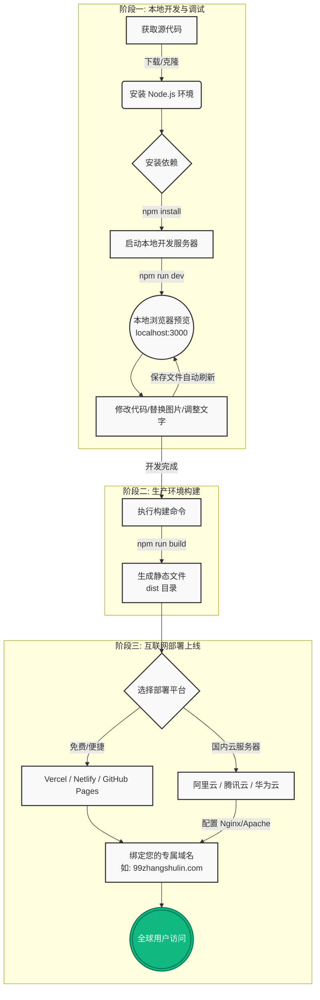

# 99樟树林 - 网站本地部署与上线指南

本文档将指导您如何将本项目的源代码下载到本地进行开发调试，并最终部署到互联网上。

## 部署流程图

## 详细步骤说明

### 1. 准备本地环境
* **安装 Node.js**: 前往 [Node.js 官网](https://nodejs.org/) 下载并安装长期支持版 (LTS)。
* **获取代码**: 点击 AI Studio 界面上的下载按钮，下载本项目的源代码压缩包并解压。
* **编辑器**: 推荐使用 [Visual Studio Code (VS Code)](https://code.visualstudio.com/) 打开项目文件夹。

### 2. 本地运行与修改
* **安装依赖**: 在 VS Code 中打开终端 (Terminal)，运行命令 `npm install`。
* **启动服务**: 依赖安装完成后，运行命令 `npm run dev`。
* **实时预览**: 打开浏览器访问 `http://localhost:3000`。
* **修改内容**: 打开 `src/App.tsx`，您可以直接修改里面的文字、替换图片链接。保存文件后，浏览器会自动刷新显示最新效果。

### 3. 构建与上线
* **打包构建**: 当您在本地修改完毕后，在终端运行 `npm run build`。这会在项目目录下生成一个 `dist` 文件夹，里面包含了所有用于生产环境的静态文件。
* **部署到服务器**:
  * **方案 A (推荐新手，免费)**: 将代码推送到 GitHub，然后使用 [Vercel](https://vercel.com/) 或 [Netlify](https://www.netlify.com/) 一键导入并自动部署。
  * **方案 B (国内云服务器)**: 购买阿里云、腾讯云等服务器，配置 Nginx 或 Apache，将 `dist` 文件夹中的内容上传到服务器的网站根目录。
* **绑定域名**: 在您的域名提供商处（如阿里云万网），将您的域名（如 `99zhangshulin.com`）解析到您的服务器 IP 或 Vercel 提供的 CNAME 地址。
